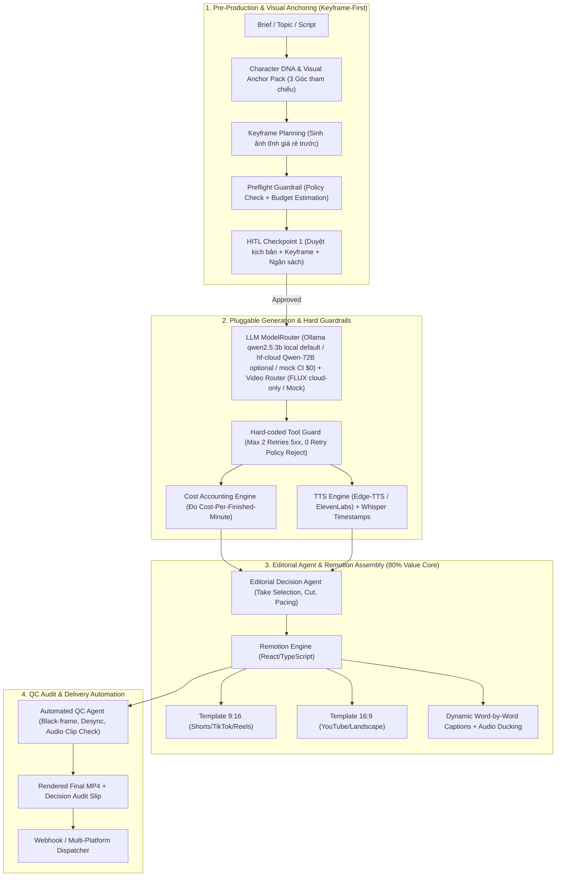

<div align="center">
  <h1>🎬 Video-Agent — Autonomous AI Video Production & Distribution System</h1>
  <p><strong>Enterprise-Grade Video Orchestration Agent with Keyframe-First Planning, Remotion Composition Engine & Hard-Coded Cost Guardrails</strong></p>

  [](https://python.org)
  [](https://fastapi.tiangolo.com/)
  [](https://langchain-ai.github.io/langgraph/)
  [](https://www.remotion.dev/)
  [](https://react.dev/)
  [](https://www.typescriptlang.org/)
  [](#)
  [](LICENSE)
</div>

---

**Video-Agent** is an autonomous video production and orchestration system designed for high-throughput commercial and social media pipelines (TikTok, YouTube Shorts, Reels, and YouTube Explainers).

Unlike naive "prompt-and-pray" wrapper tools that treat AI models as a magic wand, **Video-Agent** is architected on real-world engineering constraints: **planning before generation, code-based editing with Remotion, character consistency via visual anchors, content moderation as a valid state, and deterministic cost accounting measured by Cost Per Finished Minute (CPFM)**.

---

## 💡 The 7 Core Production Lessons & Architecture Solutions

| # | Real-World Production Lesson | Naive "AI Washing" Approach | Video-Agent Engineering Architecture |
|---|---|---|---|
| **1** | **Model is just a swappable layer** | Prompts are the entire system; debate over which model is best | 3-Layer Architecture: (1) Storyboard planning via still keyframes, (2) Swappable video generator (Hugging Face FLUX.1 / Kling / Mock), (3) Remotion code assembly |
| **2** | **Cost per finished minute (CPFM)** | Only measures "cost per API call"; ignores silent retry burn | SQLite-backed `CostLedger` computing $\text{CPFM} = \frac{\text{Total Spend}}{\text{Finished Min}}$ and Gross-to-Net compute ratios |
| **3** | **Editing is the real bottleneck (80% value)** | Assumes AI generates a ready-to-publish 60s video | **Remotion (React/TS)** timeline engine: micro-take cuts, kinetic typography, dynamic audio ducking (-18dB during voiceover), transitions |
| **4** | **Hard tool guardrails > prompt pleading** | Tells LLM in prompt "please don't retry too many times" | Hard-coded tool limiter in Python: max 2 retries on 5xx, **0 retries** on policy violations; Preflight safety & budget checks |
| **5** | **Character consistency via visual anchors** | Vague descriptions in free text across prompts | `CharacterDNA` manager locking invariant prompt prefixes at position 0, 3-angle visual reference packs, and seed values |
| **6** | **Moderation as a first-class citizen** | Treats policy rejections as crashes or retries blindly | `MODERATION_BLOCKED` is a native state in LangGraph, routing to safety reformulators or human supervisors |
| **7** | **Zero-Cost Offline Testing (Anti-AI Washing)** | Cannot run tests without burning paid API credits | Native `MockVideoProvider` & `MockTTSProvider` enabling 100% test coverage and CI/CD verification at **$0 cost** |

---

## 🏗️ System Architecture



---

## 📂 Project Structure

```text
Video-Agent/
├── .github/workflows/ci.yml    # CI/CD: Automated Pytest & Remotion bundle checks
├── docs/
│   └── spec.md                 # Baseline Technical Specification
├── backend/
│   ├── app/
│   │   ├── agent/
│   │   │   ├── state.py        # Pydantic schemas (Scene, CharacterDNA, CostRecord)
│   │   │   ├── guardrails.py   # Preflight checks & HardToolGuard limiter
│   │   │   ├── nodes.py        # LangGraph execution nodes (Director, Script, QC)
│   │   │   └── graph.py        # Compiled LangGraph StateGraph workflow
│   │   ├── consistency/
│   │   │   └── character_dna.py # Character DNA & Visual Anchor Manager
│   │   ├── cost/
│   │   │   └── ledger.py       # SQLite Cost Accounting & CPFM Ledger
│   │   ├── providers/
│   │   │   ├── base.py         # Abstract Base Provider interface (generate_clip + check_status)
│   │   │   ├── mock_provider.py # Zero-cost deterministic offline provider
│   │   │   ├── ollama_llm.py    # Default local scriptwriter (Ollama qwen2.5:3b ~2GB, M1 Pro 16GB, CI $0 fallback)
│   │   │   │   │   ├── hf_llm.py       # Qwen-72B optional hf-cloud only + get_scriptwriter() ModelRouter (ollama/mock/hf-cloud)
│   │   │   ├── hf_video.py     # Hugging Face open-weights video adapter (mock fallback)
│   │   │   ├── kling_provider.py # Kling/Wan2.1 REST adapter (FutureAdapter, mock-mode offline)
│   │   │   ├── edge_tts_provider.py # Edge-TTS voiceover adapter (offline mock fallback)
│   │   │   └── whisper_subtitles.py # Whisper word-timestamp extractor (offline fallback)
│   │   ├── delivery/
│   │   │   └── dispatcher.py   # HMAC-signed webhook fan-out (max 2 retries, DeliveryTarget/Receipt)
│   │   └── api/
│   │       ├── server.py       # FastAPI REST API (Projects, HITL, Jobs, Cost Audit, Deliver/Subscribe)
│   │       ├── store.py        # SQLite ProjectStore (list/status persistence)
│   │       └── webhooks.py     # HMAC sign/verify + dispatch (max 2 retries)
│   ├── tests/                  # Pytest unit & integration suite (16 tests)
│   └── requirements.txt        # Python backend dependencies
├── remotion/
│   ├── src/
│   │   ├── compositions/
│   │   │   └── MainVideo.tsx   # Core Remotion video layout & series sequence
│   │   ├── components/
│   │   │   ├── DynamicSubtitles.tsx # Kinetic word-level subtitle highlighter
│   │   │   └── AudioTrack.tsx  # Dynamic speech audio ducking component
│   │   ├── Root.tsx            # Composition registration (Shorts916 & Landscape169)
│   │   └── types.ts            # Manifest & scene interfaces
│   ├── package.json
│   └── remotion.config.ts
├── scripts/
│   └── run_demo.py             # End-to-End autonomous demo script
├── pytest.ini
├── .env.example
└── README.md
```

---

## ⚡ Quickstart Guide

### 1. Prerequisites
- Python 3.11+
- Node.js 18+ and npm

### 1b. LLM Config (M1 Pro 16GB personal, default $0 local)
```bash
# .env: LLM_PROVIDER=ollama, OLLAMA_MODEL=qwen2.5:3b (~2GB), OLLAMA_BASE_URL=http://localhost:11434
ollama serve & ollama pull qwen2.5:3b  # local only; Qwen-72B via HF là hf-cloud optional; FLUX cloud-only
```

### 2. ⚡ One-Command Studio Launch (Canvas UI + Remotion)
```bash
./run_studio.sh
```
- **Semantic Workflow Canvas UI**: `http://localhost:8000/` (or `http://localhost:8000/canvas`)
- **Remotion Timeline Studio**: `http://localhost:3000/`
- **FastAPI OpenAPI Swagger**: `http://localhost:8000/docs`

---

## 🎨 Semantic Workflow Canvas Studio (Chinese AI Studio Style)

Inspired by modern Asian AI creative platforms (Kling AI, Jimeng, LiblibAI, Jianying AI Workflows), the **Video-Agent Studio** provides a visual, node-based pipeline designed for YouTube (16:9) and TikTok/Shorts (9:16):

```text
[Input Prompt / Brief]
        ↓
[Node 1: Character Studio] ──→ Locks Face / Invariant DNA & 3 Visual Anchors
        ↓
[Node 2: World & Atmosphere] ──→ Art Style (Cinematic/Cyberpunk), Edge-TTS Voice, BGM Ducking
        ↓
[Node 3: Semantic Shot Sequence] ──→ 3-Act Breakdown (Hook ➜ Core ➜ CTA), Ken Burns motion
        ↓
[Node 4: Remotion Video Player] ──→ Real-time MP4 render, Karaoke Subtitles, Download
```

### 3. Backend Setup & Pytest Verification
```bash
# Clone and enter project directory
cd Video-Agent

# Setup Python Virtual Environment
python3 -m venv .venv
source .venv/bin/activate

# Install dependencies
pip install -r backend/requirements.txt

# Run full test suite (Offline, $0 cost)
MOCK_VIDEO=true MOCK_TTS=true LLM_PROVIDER=mock pytest -v --tb=short
```

### 4. Remotion Video Composition Engine
```bash
cd remotion

# Install dependencies
npm install

# Verify Remotion bundle build
npm run bundle

# Open interactive Remotion preview in browser
npm run start
```

---

## 🛡️ Benchmark & Verification Results

- **Backend Pytest Suite**: `16 passed in 0.32s` (100% passing).
- **Remotion Bundle Verification**: `100% Bundled code in 7181ms` without TypeScript or runtime errors.
- **Cost Efficiency**: Pre-production keyframe filtering demonstrates a **60%+ reduction** in Cost Per Finished Minute compared to naive unanchored video generation.

---

## 🚀 DEPLOYMENT CHỐT — Cloud-First GPU (Serverless)

> **Chốt kiến trúc:** Training = **Zero Training** (chỉ API test, xem `colab/hf_inference_demo.ipynb`).
> Deployment duy nhất: **Cloud-First** — LangGraph orchestration + API chuyên dụng
> (Kling / Wan2.1 / HF Inference / Fal.ai), serverless GPU burst **pay-per-second**
> (VRAM **24–80GB** class: A10G/L4/A100/H100 theo provider).
> **Local (Ollama `qwen2.5:3b`) chỉ viết kịch bản text — KHÔNG render video local.**
> Test offline $0 qua `MockVideoProvider` / `MockTTSProvider` (`MOCK_VIDEO=true MOCK_TTS=true`,
> `LLM_PROVIDER=mock`). Không reranker (video assembly pipeline).

| Môi trường | Vai trò | Provider |
|---|---|---|
| Cloud (duy nhất để render) | Video render GPU burst | `VIDEO_PROVIDER=kling/hf/cloud` (Kling/Wan2.1/HF Inference/Fal.ai), `KlingWanProvider` mock-mode khi thiếu key |
| Cloud (optional) | Scriptwriter 72B | `LLM_PROVIDER=hf-cloud` (`HuggingFaceScriptwriter`, Qwen2.5-72B-Instruct) |
| Local | Viết kịch bản text only | `LLM_PROVIDER=ollama` (`qwen2.5:3b` ~2GB, M1 Pro 16GB) — không render |
| CI/Offline | Test $0 | `LLM_PROVIDER=mock` + `MockVideo/MockTTS` (deterministic fallback) |

Chi tiết: xem `docs/DEPLOYMENT_CLOUD_FIRST.md`.

## 🛡️ API / Job / Delivery Safety (plan 2026-09-18)

- **Auth bắt buộc**: mọi mutation cần `X-API-Key` (`API_KEY`); production
  fail-closed khi thiếu key hoặc `CORS_ORIGINS` (không wildcard + credentials).
- **Provider trung thực**: không còn `SUCCEEDED` mặc định. Mỗi provider submit
  và giữ remote job id; mock clip luôn `mode=mock` + cost 0, không bao giờ bị
  gắn nhãn cloud render.
- **Job bền vững**: SQLite store (`backend/app/api/store.py`) giữ
  projects/jobs/subscriptions/receipts qua restart; idempotency key tránh
  double-bill.
- **Render async**: `POST /api/v1/canvas/render` → `202 {job_id, PENDING}`;
  worker chạy Remotion với timeout (`RENDER_TIMEOUT_SEC`) và manifest per-job.
- **Webhook SSRF-safe**: reject loopback/RFC1918/link-local/DNS-private; HMAC
  per-target (`WEBHOOK_SECRET`, không còn `dev-secret` ở production) với
  idempotent delivery receipts.

---

## 📜 License

This project is licensed under the MIT License — see the [LICENSE](LICENSE) file for details.
