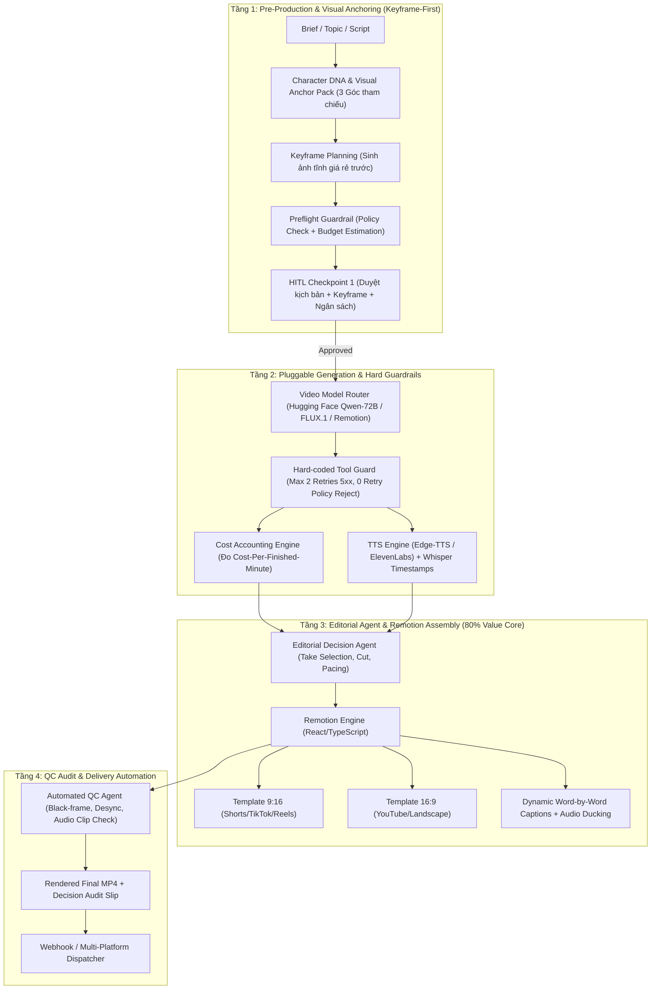

# Technical Specification: Video-Agent (Autonomous AI Video Production & Distribution System)

> **Document Status**: Approved Baseline Specification  
> **Version**: 1.0.0  
> **Target Path**: `/Users/mainguyenbinhtan/Downloads/Video-Agent`

---

## 1. Executive Summary & Core Philosophy

**Video-Agent** is an enterprise-grade autonomous video production system designed to produce short-form (9:16 - TikTok, YouTube Shorts, Reels) and long-form (16:9 - YouTube, Explainer) videos.

Unlike naive "prompt-and-pray" AI generators, **Video-Agent** treats generative models merely as a single layer within an end-to-end engineering system. It solves the real industry bottleneck: **editing, continuity, cost accounting, and deterministic guardrails**.

### The 7 Core Architectural Principles
1. **Model is not the system — it is just a swappable layer**:
   - Layer 1: Storyboard & planning before generation (keyframe images first).
   - Layer 2: Swappable video generation provider.
   - Layer 3: Code-based assembly & post-production editing (where 80% of video value is created).
2. **Economic Metric: Cost Per Finished Minute (CPFM)**:
   - Primary metric: $\text{CPFM} = \frac{\text{Total Actual Dollar Spent}}{\text{Minutes of Approved Final Video}}$.
   - Pre-production planning with cheap still images brings first-pass success from 40% up to 80%+, cutting real costs by over 60%.
3. **Editing as the Core Bottleneck**:
   - 80% of production value comes from editing decisions: micro-take selection, beat-matching, audio ducking, kinetic typography (word-level subtitles), and seamless transitions via **Remotion (React/TypeScript)**.
4. **Hard Guardrails Enforced in Tool Code**:
   - Hard retry limits coded into Python tool wrappers (e.g., maximum 2 retries on HTTP 5xx; 0 retries on policy/moderation rejects).
   - Preflight validation before render to eliminate compute waste.
5. **Character & Scene Consistency via Visual Anchors**:
   - Character DNA module with 3-angle reference anchors, locked prompt prefix, seed consistency, and identity embeddings.
6. **Content Moderation as a First-Class Citizen**:
   - `MODERATION_REJECTED` is treated as a valid state in the state machine, triggering `SafetyReformulator` or human review, never blind retries.
7. **Production Reality & Zero-Cost Offline Testing (Anti-AI Washing)**:
   - Comprehensive test suite with `MockVideoProvider` and `MockTTSProvider` ensuring 100% test pass offline without burning API budget.

---

## 2. System Architecture

---

## 3. Component Details

### 3.1 LangGraph Multi-Agent Orchestration
- **Director Agent**: Parses incoming brief, defines narrative arc, theme, target audience, and duration (e.g. 30s-60s).
- **Scriptwriter Agent**: Writes shot-by-shot script with visual action prompts, voiceover text, and timing cues.
- **Storyboarder & Anchor Agent**: Establishes Character DNA and visual anchors; outputs keyframe image prompts.
- **Preflight & Budget Guardrail**: Enforces cost ceilings and scans prompt words for safety red flags before any video API is called.
- **Human-in-the-Loop (HITL) Checkpoint**: Allows human creator to inspect storyboard images, approve budget, or adjust prompt parameters.
- **Editorial Agent**: Determines scene sequencing, cut duration, transition styles, and audio ducking levels.
- **Automated QC Agent**: Evaluates rendered video for audio-video sync drift, black-frame artifacts, and speech clarity.

### 3.2 Pluggable Video & Audio Generation Layer
- **Provider Interface (`BaseVideoProvider`)**:
  - `generate_clip(prompt: str, duration_sec: float, reference_images: list[str], seed: int) -> VideoClipResult`
  - `check_status(job_id: str) -> JobStatus`
- **Supported Adapters**:
  - `MockVideoProvider`: Generates lightweight synthetic/color video clips with timestamp watermark for instant, free local testing and CI/CD.
  - `Hugging FaceOmniFlashProvider`: Calls Google GenAI SDK for Hugging Face Serverless (Qwen-72B & FLUX.1) generation/editing.
  - `KlingWanProvider`: Standard HTTP REST wrapper for Kling/Wan2.1 video generation APIs.
- **TTS & Captions**:
  - `EdgeTTSProvider`: High-quality, free multilingual voiceover synthesis (Vietnamese, English, etc.).
  - `WhisperSubtitleExtractor`: Generates JSON with word-level timestamps (`[{word: "Xin", start: 0.1, end: 0.3}, ...]`).

### 3.3 Remotion Timeline Engine (React/TypeScript)
- **Compositions**:
  - `Shorts916`: 1080x1920 @ 30 FPS.
  - `Landscape169`: 1920x1080 @ 30 FPS.
- **Features**:
  - `DynamicSubtitles`: Highlight-on-word karaoke style with configurable bounce/fade animations.
  - `AudioDucker`: Automatically reduces background music volume by -18dB whenever speech audio is present.
  - `B-Roll Stitcher`: Overlays secondary visual takes during pacing lulls.

### 3.4 Cost Accounting & Ledger Engine
- Every call records:
  - `job_id`, `provider`, `prompt_tokens`, `video_seconds_generated`, `dollar_cost`, `attempt_number`, `status`.
- Aggregates metrics:
  - `total_spend_usd`
  - `gross_generated_seconds`
  - `final_video_seconds`
  - `cost_per_finished_minute` (CPFM)
  - `retry_ratio`

---

## 4. Safety & Content Moderation Strategy

1. **Preflight Word & Topic Filter**: Scans prompt against safety policies before spending budget.
2. **Deterministic Tool Guard**:
   - `HTTP 5xx`: Exponential backoff up to max 2 retries.
   - `Policy Violation (400/403/Moderation)`: 0 retries. Emits `MODERATION_BLOCKED` event to state machine.
   - `State Transition`: Diverts to `SafetyReformulatorNode` or pauses for human correction.

---

## 5. Verification & Acceptance Criteria
- **Unit & Integration Tests**:
  - Preflight checks block unsafe prompts and budget overflows.
  - Hard retry limiter terminates on retry count 2.
  - Mock provider generates valid MP4 timeline files.
  - Cost tracker accurately calculates Cost Per Finished Minute.
  - Remotion composition passes bundling check (`npx remotion bundle`).
- **CI/CD Integration**: Fully runnable in GitHub Actions with zero paid API dependencies.
